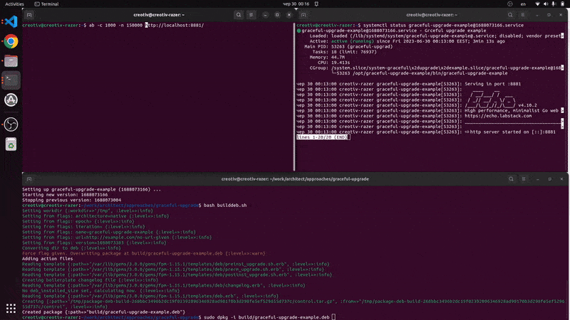

# Graceful upgrade with Systemd through DEB package

## Requirements:
- Ubuntu
- [Go 1.19+](https://go.dev/doc/install)
- [FPM](https://github.com/jordansissel/fpm) 

## What is graceful upgrade?
Graceful upgrade, often also referred to as a zero-downtime upgrade or seamless upgrade, is a process in which a system or service is upgraded without causing any disruption to the operation of the system or service. It involves transitioning from the old version to the new version in a manner that is transparent to users and doesn't result in any downtime.

In the context of web services or databases, this usually involves running two versions of the software side by side, directing new connections to the new version while allowing existing connections to complete on the old version. Once all the old connections have been completed, the old version can be decommissioned.

The primary goal of a graceful upgrade is to avoid interruption of service, which is especially important for services that are expected to be available around the clock. In these cases, even a short period of downtime can have significant impacts. 

## How this can be implimented?
### Socket activation
Socket activation is a feature provided by systemd that allows on-demand starting of services. This means that a service can be started when it is actually needed, for instance when a specific incoming network connection or local inter-process communication (IPC) request is made.

When systemd is set up for socket activation, it starts by listening on a certain socket (which could be a network socket, a Unix domain socket, a FIFO, etc.). When a connection is received on this socket, systemd then starts the corresponding service to handle that connection.

You can read more here about it: https://vincent.bernat.ch/en/blog/2018-systemd-golang-socket-activation

The main problem that it's very hacky, and not always working as expected

### SO_REUSEPORT
SO_REUSEPORT is a socket option used in network programming that allows multiple sockets on the same host to bind to the same port number. This can be used for load balancing incoming connections across multiple processes or threads.

When you start a network service, typically it binds a socket to a specific IP address and port number. Traditionally, trying to bind another socket to the same IP address and port number would fail, with the operating system preventing you from reusing the same port.

SO_REUSEPORT changes this behavior. If this socket option is set, the operating system will allow multiple sockets to be bound to the exact same combination of IP address and port number, as long as SO_REUSEPORT is set on each socket. This can be particularly useful in multi-threaded or multi-process servers, as it allows each thread or process to have its own listening socket, and the operating system's networking stack will balance incoming connections across the sockets.

This variant is much better because it's simpler, works flawlessly, and requires minimal changes to our application's code.

## What we will do?
To make magic happen we will:
- Build our web server and pack in a deb package with FPM
- Deb package will include systemd scripts
- Those script will create new version of service and stop previous one.

## Description
FPM - is just a tool to create installer packager for various platforms.

Systemd - init service that control of running different services on your machine.

When using systemd there are two types of service configuration:

- xxxxxx.service - in such way you can run only one instance of the service
- xxxxxx@.service - in such way you can run multiple instances of the service

You can read more here about that: https://opensource.com/article/20/12/multiple-service-instances-systemctl

Our Deb package installation process have few hooks like pre and post install/upgrade. 
With their help we can start and stop our processes gracefuly. Just check the `systemd` directory

So in pre install script we just getting and saving curent(old one) version of the app.
In the post install script we reload daemon as we may change service scripts, and then just start new app, wait for some time, and stop old one.

If we want so the service autostart after restart we should add directives:

`systemctl enable graceful-upgrade-example@version` and `systemctl disable graceful-upgrade-example@version`

## Time to run it
- Run `bash builddeb.sh` this will build package in build/graceful-upgrade-example.deb
- Run `sudo dpkg -i build/graceful-upgrade-example.deb` this will install package
- You can check status by systemctl status build/graceful-upgrade-example@<version-of-deployed-package-from-console>
- Open new console window and run there `ab -c 1000 -n 200000 https://localhost:88881/`
- While it running run `bash builddeb.sh` and `sudo dpkg -i build/graceful-upgrade-example.deb` to install new version
- In the end of AB test you will see that zero packages are lost :)
