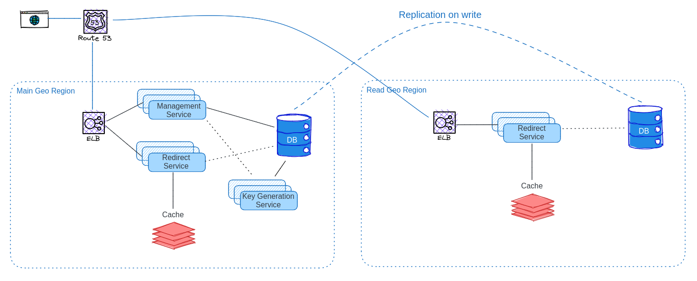

# URL Shortener Service

## Step 1: Business Case

The URL shortener service is designed to generate shortened versions of long URLs and redirect users to the original URLs when accessed. The following requirements should be considered:

- Users should be redirected to the original URL when accessing the short version.
- Users can add custom URL paths like "short.io/custom-name"
- Users can track simple analytics such as the number of views using an admin key generated with the URL.
- Users are limited to adding up to 10 URLs per day.
- The service should be capable of handling 100 million requests per day.
- The service should be able to scale up or down easily.
- Shortened URLs should be saved for a period of two months.

## Step 2: KPM & Constraints

Key Performance Metrics:
- Redirect response latency: <50ms
- Uptime: 99.99%
- Server load: 80%
- Analytics lag time: up to 10 minutes

Constraints:
- Initial launch traffic:
  - Reads/Writes ratio: 100:1
  - Daily Reads: 99 million requests
  - Daily Writes: 1 million requests
  - Linear load
  - Read RPS (Requests Per Second): 1,145
  - Write RPS: 12
- Bandwidth:
  - Write: 20KB/s
  - Read: 0.7MB/s
- Storage:
  - Database (DB): 27GB for two months (with growth coefficient)
  - Cache: 8.1GB for two months (30% of DB storage)

## Step 3: Data to be Saved

The data to be saved in the URL shortener service includes:

Short URL object:
- Original URL
- Short URL
- Admin key
- Created timestamp

Stats object:
- Short URL
- Number of views

## Step 4: Third-Party Components

The following third-party components can be considered for the solution:

Database (DB):
- AWS DynamoDB, ScylaDB, Cassandra, Redis, Couchbase, etc.

Cache:
- Redis, AWS ElastiCache, Memcached

Components should be evaluated based on features, pricing, and suitability for the solution. In this case, Redis running on an EC2 instance is chosen to minimize the number of different software used, simplify management, and reduce licensing costs.

## Step 5: High-Level Design

The high-level design of the architecture includes two types of services: one for redirecting and another for managing URLs. Geo-replication is used to reduce latency for redirecting pages, while URL management services are hosted in a single geo-location to simplify the solution and reduce costs.

## Step 6: Analysis and Pre-testing

At this stage, we have a clear understanding of our requirements and the components needed to build the system. Here, we delve deeper into understanding how these components will work and the specifics of their usage. Additionally, we conduct pre-tests to validate certain statements and address questions such as:

- Can Redis handle the anticipated load with good read latency?
- How can we replicate the Redis cluster to different geo-locations? Is it possible?
- And other relevant questions.

### Simplified Key Generation Service

Most URL shortener recommendations on the internet suggest using a Key Generation (KG) Service with an additional database for saving keys. However, this approach can be costly and unnecessary. Instead, I propose a simplified method.

Rather than managing used/free URLs, we only need to save a counter. This approach significantly reduces storage requirements, from 2-30GB to just a few bytes.

Given that we have 7 symbols in our URL range, from `aaaaaaa` to `zzzzzzz`, we have 8 billion combinations. Let's assume `aaaaaaa` represents 1 and `zzzzzzz` represents 8 billion, with `aaaaaab` being 2, and so on. To generate a new URL, we increment the counter and translate it into a string based on our algorithm. To minimize the load on the database, we can generate URLs in batches of 100-1000, depending on the load. Using batches also introduces some randomness to the URL names.

Considering that we have 1 million new URLs per day, totaling 60 million URLs over two months, and each URL has a lifespan of only 2 months, once we reach 8 billion on our counter, the URL under index 1 will already be available for reuse. This implementation resembles a round-robin algorithm.

The only aspect to monitor is that the rate at which URLs are added remains below the capacity of the 7-symbol URL range.

### Redis TTL

Redis is an excellent choice for our use case, offering valuable functionality, including Key Time-To-Live (TTL), which eliminates the need for manual removal of expired URLs.

### Cluster Replication

While free Redis does not provide cluster replication functionality, we can easily add it by creating a proxy service that replicates all commands from the main cluster to the read clusters. The simplicity of the Redis protocol makes this task straightforward.

The replication can be both synchronous and asynchronous, depending on the speed and number of geo-clusters. Additionally, we need to implement write-ahead logs for all replication operations to ensure data integrity in the event of service failures.

### View Statistics

While robust statistics require an additional service group, for saving views alone, we can employ a different approach.

Saving views during high-load situations is not a straightforward task. Simply incrementing the count on Redis would create a significant load on the database, even if it's an in-memory database. To mitigate this, each redirect instance will have a thread dedicated to saving statistics at specified time intervals or memory limits. Before saving, views will be stored in the instance's memory or disk, minimizing the number of calls made to the database.

An alternative probabilistic method that was popular 15 years ago is setting a write probability, such as 20%. Once triggered, the view count increments not by one, but by 5 (100/20). While this approach is imprecise with small numbers, it performs reasonably well with large numbers. However, we will utilize the first approach as the second does not guarantee that randomness will not lead to potential issues.

The statistics will be saved through a service in the main geo cluster, with the possibility of replacing it with a more robust solution in the future.

### Docker Container Deployment

To simplify deployment, testing, reproducibility, and enhance dependency isolation, we will run all our services inside Docker containers. Although this may introduce a small overhead, it significantly streamlines the development process. It is important to remember that the cost of servers is not the only consideration; the cost of developers is often higher.

## Step 7: Detailed Design

Detailed design involves breaking down complex components into separate schemes and describing processes in more detail.

## Step 8: Contingency Planning

In this step, we need to understand how to handle different types of failures and plan for contingencies. For example:

### What if Stats Service Fails?
If the Stats Service fails, we have a couple of options to handle the situation:
- Save data on instances for a longer period until the service is restored.
- Store data on an S3 bucket, which can be read and synced when the service becomes operational again.

### What if Data Service Fails?
If the Data Service fails, we will take the following actions:
- Stop adding new URLs temporarily.
- The redirect service will use a direct backup connection to the Redis cluster.
- With the use of Write-Ahead Logs (WAL) in our Data Service, once the server is back online, it will reproduce all data that was not previously replicated.

These contingency plans ensure that data is safeguarded and operations can resume smoothly in the event of service failures.

## Step 9: Writing Documentation

Documentation is created to provide detailed instructions for developers, including comprehensive information about the system's architecture, components, and processes.

## Step 10: Development & Integration Plan

A development and integration plan is formulated based on the designed architecture, outlining the steps required for implementing the system.

## Step 11: Development and Control

As an architect, it is essential to oversee the development process and ensure that the system is being implemented according to the designed architecture.

PS: For drawing I used this service: https://excalidraw.com/
